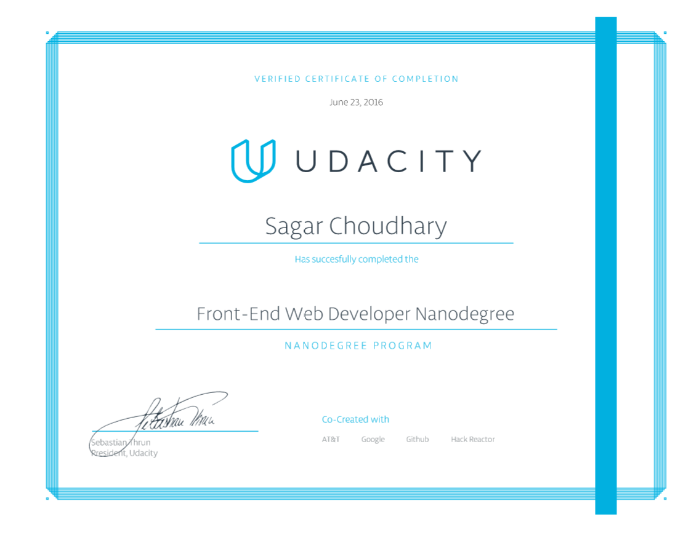

# Front End NanoDegree Udacity

#### About NanoDegree
The NanoDegree Focuses on Developing User Experiences &
Interactive Websites. Covers All the Major Front End Concepts.
Adequate for Complete Beginners.

#### Topics Covered
* HTML
* CSS
* JavaScript
* Object Oriented JavaScript
* Node JS
* Knockout JS
* Bower
* Google Maps & Other APIs
* Jasmine Testing Suite
* Google PageSpeed Insights
* Latest Web Practices
* & Many More...

#### NanoDegree Certificate

